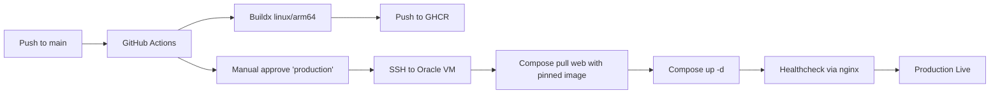

# CI/CD: GitHub Actions → GHCR → SSH → Docker Compose

This document details the production deployment pipeline implemented in this repository using:
- GitHub Actions (CI)
- GitHub Container Registry (GHCR) for container images
- SSH deployment to an Oracle Cloud VM (Ampere A1)
- Docker Compose overlays for production

Related repository files:
- Workflow: [`.github/workflows/deploy.yml`](../.github/workflows/deploy.yml)
- Deploy overlay: [`docker-compose.deploy.yml`](../docker-compose.deploy.yml)
- Base Compose: [`docker-compose.yml`](../docker-compose.yml)
- Production overlay: [`docker-compose.prod.yml`](../docker-compose.prod.yml)
- Runtime image and server: [`Dockerfile`](../Dockerfile), [`docker/entrypoint.sh`](../docker/entrypoint.sh), [`gunicorn.conf.py`](../gunicorn.conf.py)
- Nginx config: [`docker/nginx/default.conf`](../docker/nginx/default.conf)
- App settings / env example: [`ecom/settings.py`](../ecom/settings.py), [`.env.example`](../.env.example)



## 1) What the pipeline does

On push to `main` or a tag `v*.*.*`:
1) Builds the application Docker image for `linux/arm64` using Docker Buildx.
2) Pushes the image to GHCR with two tags:
   - `ghcr.io/<owner>/<repo>:<git-sha>`
   - `ghcr.io/<owner>/<repo>:latest`
3) SSHes into the Oracle VM and deploys by:
   - Pulling the `web` image pinned to the `git-sha`
   - Running Compose with the production overlay AND the deploy overlay, which pins `web` to the pulled image
   - Performing a healthcheck via nginx `http://localhost/`

The workflow is implemented in [`.github/workflows/deploy.yml`](../.github/workflows/deploy.yml).

## 2) One-time server preparation

Perform on the Oracle VM:

- Create a non-root deploy user and give Docker access:
  - `sudo adduser deploy`
  - `sudo usermod -aG docker deploy`
  - `newgrp docker`

- Ensure Docker is installed and enabled:
  - `curl -fsSL https://get.docker.com | sudo sh`
  - `sudo systemctl enable --now docker`

- Create application directory and place repo:
  - `sudo mkdir -p /opt/ecom && sudo chown -R deploy:deploy /opt/ecom`
  - Clone or upload your repo contents into `/opt/ecom`

- Create the production `.env` from example in `/opt/ecom`:
  - `cp .env.example .env`
  - Set values: strong `SECRET_KEY`, `DEBUG=false`, proper `ALLOWED_HOSTS` and `CSRF_TRUSTED_ORIGINS`, strong `POSTGRES_PASSWORD`

- Add GitHub Actions deploy public key to `/home/deploy/.ssh/authorized_keys` (permissions: dir 700, file 600)

- Network hardening (Oracle Security List / NSG):
  - Allow TCP/80 (HTTP) from 0.0.0.0/0
  - Restrict TCP/22 (SSH) ONLY to your IP/CIDR (never 0.0.0.0/0)

## 3) GitHub repository configuration

Add repository secrets (Settings → Secrets and variables → Actions → New repository secret):

Required:
- `SSH_HOST` → Oracle VM public IP
- `SSH_USER` → `deploy`
- `SSH_KEY` → Private key matching the public key added to the server
- `SSH_PATH` → `/opt/ecom` (the directory containing your compose files)

Optional:
- `SSH_PORT` → Optional SSH port override (default `22`)
- `GHCR_USERNAME` → Your GitHub username (if GHCR images are private)
- `GHCR_TOKEN` → A Personal Access Token with `read:packages` (if GHCR images are private)

Environment protection (recommended):
- Settings → Environments → New environment `production`
- Require reviewers / manual approval before deployment
- Limit deployment branches if desired

## 4) Deploy overlay

The file [`docker-compose.deploy.yml`](../docker-compose.deploy.yml) is used only during CI/CD on the server:
- It forces the `web` service to use a pre-built image (from GHCR) instead of building locally.
- The workflow sets `IMAGE=ghcr.io/<owner>/<repo>:<git-sha>` and runs compose with the overlay:
  ```
  IMAGE=... docker compose -f docker-compose.yml -f docker-compose.prod.yml -f docker-compose.deploy.yml pull web
  IMAGE=... docker compose -f docker-compose.yml -f docker-compose.prod.yml -f docker-compose.deploy.yml up -d
  ```

This ensures reproducible deployments pinned to a specific commit SHA.

## 5) Manual runbook (debug / first-time)

- Build & start (production):
  ```
  docker compose -f docker-compose.yml -f docker-compose.prod.yml up -d --build
  ```
- Logs:
  ```
  docker compose logs -f db
  docker compose logs -f web
  docker compose logs -f nginx
  ```
- Admin / Migrations:
  ```
  docker compose exec web python manage.py createsuperuser
  docker compose exec web python manage.py migrate
  docker compose exec web python manage.py collectstatic --noinput
  ```

## 6) Rollback procedure

To roll back to a previous deployment:

- On the server:
  ```
  cd $SSH_PATH
  IMAGE=ghcr.io/<owner>/<repo>:PRIOR_SHA \
    docker compose -f docker-compose.yml -f docker-compose.prod.yml -f docker-compose.deploy.yml up -d
  ```
- Or re-run the “Deploy” job in GitHub Actions targeting the previous commit SHA.

## 7) Security considerations

- Do not commit `.env`. Keep it only on the server (and protect server backups).
- Restrict SSH to your IP in Oracle Security List / NSG.
- Keep `DEBUG=false` in production; see [`ecom/settings.py`](../ecom/settings.py) and `.env`.
- Use strong `SECRET_KEY` and `POSTGRES_PASSWORD`.
- Database is only accessible inside the Docker network (no host port publishing).
- Consider periodic `pg_dump` backups off the VM and secure their storage.
- Use environment protection on GitHub (“production” requires manual approval).

## 8) Troubleshooting CI/CD

- SSH step fails:
  - Verify secrets `SSH_HOST`, `SSH_USER`, `SSH_KEY`, and `SSH_PATH`.
  - Confirm the key matches the one in `authorized_keys`.
  - Ensure Security List/NSG allows your runner’s egress to TCP/22 and your VM’s ingress from GitHub runners.

- Image pull fails:
  - If GHCR is private, ensure `GHCR_USERNAME` and `GHCR_TOKEN` are set with correct permissions.
  - Confirm image exists at `ghcr.io/<owner>/<repo>:<git-sha>`.

- Healthcheck fails:
  - Check `docker compose logs -f web nginx`.
  - Verify `.env` contains correct `ALLOWED_HOSTS` and `CSRF_TRUSTED_ORIGINS`.
  - Run `docker compose ps` and confirm services are healthy.

- Static files not served:
  - Run `docker compose exec web python manage.py collectstatic --noinput`.
  - Verify nginx volume mount and config path `/staticfiles/` in [`docker/nginx/default.conf`](../docker/nginx/default.conf).

## 9) How the workflow is structured

See [`.github/workflows/deploy.yml`](../.github/workflows/deploy.yml):
- `build-and-push` job:
  - Sets up QEMU and Buildx
  - Logs in to GHCR using the GitHub-provided token
  - Builds and pushes `linux/arm64` image with tags `:git-sha` and `:latest`
- `deploy` job:
  - Requires environment `production` (enable approvals in repo settings)
  - SSH into server with `appleboy/ssh-action`
  - Optionally logs in to GHCR on server (for private images)
  - Pulls the pinned image and brings the stack up using the overlay
  - Verifies nginx http://localhost/ responds; prints recent logs if not
- Concurrency: uses a group `production-deploy` to prevent overlapping production deployments
- Environment URL: sets the production environment URL to `http://${{ secrets.SSH_HOST }}` for quick access in the Actions UI

## 10) Extending the pipeline

- Staging environment:
  - Duplicate the deploy job as “staging” with different SSH_* secrets and environment protection.
- Notifications:
  - Add Slack/Teams notification steps after successful deploy or on failure.
- Database migrations:
  - For complex migrations, run a dedicated migration job before rolling the web service.
- Multi‑arch images:
  - If you plan to target x86 hosts too, build and push for `linux/amd64,linux/arm64` (note: builds will be slower).
- Image hygiene:
  - Periodically prune unused images on the server to save disk:
    - `docker image prune -f --filter 'until=168h'`
