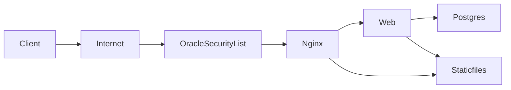

# Oracle Cloud Deployment Guide (Ampere ARM64)

This is the step-by-step deployment runbook focused on Oracle Cloud Free Tier Ampere (ARM64). It aggregates the operational guidance we discussed and references repo files:
- Docker runtime: [Dockerfile](../Dockerfile)
- Entrypoint: [docker/entrypoint.sh](../docker/entrypoint.sh)
- Gunicorn config: [gunicorn.conf.py](../gunicorn.conf.py)
- Nginx config: [docker/nginx/default.conf](../docker/nginx/default.conf)
- Compose (base): [docker-compose.yml](../docker-compose.yml)
- Compose (prod overlay): [docker-compose.prod.yml](../docker-compose.prod.yml)
- Deploy overlay (pull image): [docker-compose.deploy.yml](../docker-compose.deploy.yml)
- Env template: [.env.example](../.env.example)
- Django settings: [ecom/settings.py](../ecom/settings.py)
- CI/CD workflow: [.github/workflows/deploy.yml](../.github/workflows/deploy.yml)



## 1) Prerequisites and Planning

- Instance shape: VM.Standard.A1.Flex (Always Free) with 1 OCPU, 6 GB RAM (adjust later).
- OS: Ubuntu 22.04 LTS or Oracle Linux 8/9.
- Region/AD: If Ampere capacity is unavailable, try a different AD or region.

## 2) Networking and Security (Oracle Cloud VCN/Subnets/Rules)

Goal: place your VM in a VCN with a Public Subnet (Internet-facing), an Internet Gateway, and tight security rules that only allow:
- HTTP (80/tcp) from anywhere
- Optional HTTPS (443/tcp) from anywhere
- SSH (22/tcp) from only your workstation’s public IP (a single-address CIDR /32)

A) Create VCN and Public Subnet (Console)
- Networking → Virtual Cloud Networks → Create VCN.
  - Quick Create is fine. It creates:
    - VCN (RFC1918 CIDR, e.g. 10.0.0.0/16)
    - Public Subnet (e.g. 10.0.0.0/24) with a Route Table to Internet Gateway
    - Internet Gateway (IGW)
    - Default Security List
- Verify the Public Subnet:
  - Has a Route Table with a 0.0.0.0/0 route to the Internet Gateway
  - DHCP options exist (default is fine)
  - “Public Subnet” means instances in it can have Public IPv4 addresses

B) Choose Security List vs. NSG (Network Security Group)
- Security Lists apply to all VNICs in a subnet (coarse-grained).
- NSGs attach to a specific instance/VNIC (fine-grained, recommended).
- Use either, but NSG is preferred so you don’t loosen rules for every VM in the subnet.

C) Create inbound rules (NSG or Security List)
- HTTP:
  - Stateless: No (stateful default)
  - Protocol: TCP
  - Source Type: CIDR
  - Source CIDR: 0.0.0.0/0
  - Destination Port: 80
- HTTPS (optional for TLS later):
  - Same as above, Destination Port: 443
- SSH (restricted):
  - Protocol: TCP
  - Source Type: CIDR
  - Source CIDR: YOUR_PUBLIC_IP/32 (single IP)
  - Destination Port: 22
- Egress: Allow 0.0.0.0/0 (default outbound OK) so the VM can pull packages and images.

D) Public IP on the VM
- When launching the instance, ensure:
  - Subnet: your Public Subnet
  - Assign public IPv4 address: Enabled (Ephemeral is fine; Reserved is optional if you need a fixed address)
  - Attach the NSG you created (or rely on the Subnet’s Security List)

E) What is “YOUR IP”?
- It means your workstation’s current public IPv4 on the internet (not your LAN 192.168.x or 10.x address).
- Find it:
  - curl -4 ifconfig.me
  - curl -4 https://api.ipify.org
  - dig +short myip.opendns.com @resolver1.opendns.com
- Convert to a single-address CIDR by appending /32. Example: 203.0.113.45 → 203.0.113.45/32
- If your ISP changes your IP frequently (dynamic IP), you may need to update the rule after it changes. Temporarily, you can allow a slightly larger CIDR belonging to your ISP, but keep it as narrow and short-lived as possible.
- If you are behind CGNAT/hotel Wi‑Fi and cannot restrict by IP, consider using:
  - Oracle Bastion, or
  - A VPN/static egress IP, or
  - Temporarily open 22/tcp narrowly with strict time window and then close it.

Security warning:
- Never leave SSH (22) open to 0.0.0.0/0.
- Prefer NSGs attached to the instance over broad Security List changes for the whole subnet.

## 3) Launch the Compute Instance

- Shape: VM.Standard.A1.Flex, 1 OCPU, 6 GB RAM.
- Image: Ubuntu 22.04 (or Oracle Linux 8/9).
- Networking: Public IPv4 (on public subnet).
- SSH keys: Provide your public key; login user is `ubuntu` (Ubuntu) or `opc` (Oracle Linux).

## 4) Install Docker

SSH in:
```
ssh ubuntu@YOUR_PUBLIC_IP
# or: ssh opc@YOUR_PUBLIC_IP
```

Install Docker:
```
# Ubuntu updates
sudo apt-get update -y && sudo apt-get upgrade -y
# Oracle Linux equivalent:
# sudo dnf upgrade -y

# Install Docker
curl -fsSL https://get.docker.com | sudo sh
sudo usermod -aG docker $USER
newgrp docker
sudo systemctl enable --now docker

# Verify
docker --version
docker run --rm hello-world
```

## 5) OS Firewall (if enabled)

Ubuntu ufw:
```
sudo ufw allow 22/tcp
sudo ufw allow 80/tcp
# Optional (future TLS):
sudo ufw allow 443/tcp
sudo ufw enable
```

Oracle Linux firewalld:
```
sudo firewall-cmd --add-service=http --permanent
sudo firewall-cmd --add-service=https --permanent
sudo firewall-cmd --reload
```

## 6) Place the App on the Server and Configure

Create directory and copy/clone repo:
```
sudo mkdir -p /opt/ecom
sudo chown -R $USER:$USER /opt/ecom
cd /opt/ecom
# git clone <your-repo> .   # or upload files
```

Create production .env from [example](../.env.example):
```
cp .env.example .env
```
Edit `.env`:
- SECRET_KEY: strong random value
- DEBUG=false
- ALLOWED_HOSTS=YOUR_PUBLIC_IP,your.domain
- CSRF_TRUSTED_ORIGINS=http://YOUR_PUBLIC_IP,https://your.domain (must include scheme)
- POSTGRES_USER/POSTGRES_DB/POSTGRES_PASSWORD: set strong values
- DATABASE_URL defaults to internal db service if not overridden

Security warning:
- Never commit `.env`. Keep it only on the server.

## 7) First Production Run (Optional Manual Validation)

Start the stack:
```
docker compose -f docker-compose.yml -f docker-compose.prod.yml up -d --build
```

Services:
- db: Postgres 16-alpine
- web: Gunicorn (runs migrations, collectstatic)
- nginx: serves /static and proxies to web; publishes port 80

Check logs:
```
docker compose logs -f db
docker compose logs -f web
docker compose logs -f nginx
```

Visit:
- http://YOUR_PUBLIC_IP/

## 8) CI/CD (Automated Deployment)

CI/CD files:
- Workflow: [.github/workflows/deploy.yml](../.github/workflows/deploy.yml)
- Deploy overlay: [docker-compose.deploy.yml](../docker-compose.deploy.yml)

How it works:
- On push to main or vX.Y.Z tags:
  - Build ARM64 image with Buildx.
  - Push to GHCR: `ghcr.io/<owner>/<repo>:<git-sha>` and `:latest`.
  - SSH to server and deploy using the deploy overlay to pin `web` image to the new tag.

Server setup for CI/CD:
- Create a `deploy` user; grant Docker access:
  ```
  sudo adduser deploy
  sudo usermod -aG docker deploy
  newgrp docker
  ```
- Put public deploy key into `/home/deploy/.ssh/authorized_keys` (dir 700, file 600).
- Oracle Security List/NSG: restrict SSH (22) to your IP.

GitHub Actions Secrets:
- SSH_HOST → server public IP
- SSH_USER → deploy
- SSH_PORT → 22 (optional)
- SSH_KEY → private key matching the server’s authorized key
- SSH_PATH → /opt/ecom
- If GHCR private: GHCR_USERNAME and GHCR_TOKEN (PAT with read:packages)

Deployment uses:
```
IMAGE=ghcr.io/<owner>/<repo>:<git-sha> docker compose \
 -f docker-compose.yml -f docker-compose.prod.yml -f docker-compose.deploy.yml pull web

IMAGE=ghcr.io/<owner>/<repo>:<git-sha> docker compose \
 -f docker-compose.yml -f docker-compose.prod.yml -f docker-compose.deploy.yml up -d
```

Rollback:
```
cd /opt/ecom
IMAGE=ghcr.io/<owner>/<repo>:PRIOR_SHA docker compose \
 -f docker-compose.yml -f docker-compose.prod.yml -f docker-compose.deploy.yml up -d
```

## 9) Static Files and Vite

- Vite builds into `static/dist` with manifest; see vite config.
- `collectstatic` copies into `/app/staticfiles`.
- Nginx serves `/static/*` from `/staticfiles/` (mounted read-only).
- Django WhiteNoise CompressedManifest storage is enabled to ensure hashed asset names and safe fallbacks; in production, Nginx is the primary static server while WhiteNoise primarily guarantees manifest correctness.

## 10) Admin and Data Ops

Create superuser:
```
docker compose exec web python manage.py createsuperuser
```

Migrations and static:
```
docker compose exec web python manage.py migrate
docker compose exec web python manage.py collectstatic --noinput
```

Backups:
```
docker compose exec db pg_dump -U "$POSTGRES_USER" "$POSTGRES_DB" > /tmp/ecom.sql
```
Move backups off the VM; store encrypted.

## 11) TLS (HTTPS)

- Recommended: Oracle Load Balancer (Always Free) with TLS termination → forward HTTP to VM.
- Alternative: Extend Nginx + certbot (additional container and config).

## 12) Production Defaults Recap

- Production runs with DEBUG=false (via env and compose overlay).
- SECRET_KEY and DB credentials come from `.env`.
- [ecom/settings.py](../ecom/settings.py) reads from env with SQLite fallback for local dev.

## 13) Troubleshooting

- 502 from Nginx:
  - `docker compose logs -f web nginx`
  - Ensure web is healthy and listening on 0.0.0.0:8000
- 403/CSRF:
  - Verify ALLOWED_HOSTS and CSRF_TRUSTED_ORIGINS (with scheme)
- Static files missing:
  - `docker compose exec web python manage.py collectstatic --noinput`
  - Confirm nginx mounts staticfiles volume and path `/staticfiles/`
- Port 80 unreachable:
  - Check Oracle Security List/NSG and OS firewall
- DB connection:
  - Validate DATABASE_URL and POSTGRES_* match, check db logs

## 14) Resource Tuning (Ampere)

Gunicorn (see [gunicorn.conf.py](../gunicorn.conf.py)):
- WEB_CONCURRENCY=2 for 1 OCPU (adjust by load)
- GUNICORN_THREADS=2
- Increase instance OCPUs/RAM if CPU or memory bottlenecks occur.

## 15) Quick Commands

Start (prod):
```
docker compose -f docker-compose.yml -f docker-compose.prod.yml up -d --build
```

Logs:
```
docker compose logs -f db
docker compose logs -f web
docker compose logs -f nginx
```

Deploy via pinned image:
```
IMAGE=ghcr.io/<owner>/<repo>:<git-sha> docker compose \
 -f docker-compose.yml -f docker-compose.prod.yml -f docker-compose.deploy.yml up -d
```

Stop:
```
docker compose -f docker-compose.yml -f docker-compose.prod.yml down
```

## 16) First‑Time Deployment: Step‑by‑Step (Copy/Paste)

WARNING
- Never expose SSH (22/tcp) to the whole internet. Restrict to your IP/CIDR in Oracle Security List/NSG.
- Keep DEBUG=false in production. Do not commit .env or secrets to Git.
- Ensure ALLOWED_HOSTS and CSRF_TRUSTED_ORIGINS are set correctly (CSRF requires scheme, e.g., https://example.com).
- Database must not be published on a public interface.

Step 1 — Launch the Oracle VM
- Shape: VM.Standard.A1.Flex (1 OCPU, 6 GB RAM).
- OS: Ubuntu 22.04 or Oracle Linux 8/9.
- Assign a public IPv4 and put the instance in a public subnet.

Step 2 — Network firewalling (VCN, Subnet, Rules, “YOUR IP” explained)

Oracle VCN/Subnet basics
- Use a VCN with a Public Subnet that routes 0.0.0.0/0 to an Internet Gateway (IGW).
- Launch the VM into that Public Subnet and assign a Public IPv4 address (Ephemeral is fine).
- Prefer NSGs attached to the VM’s VNIC for security rules.

Ingress rules (NSG or Security List)
- HTTP (80/tcp): Source 0.0.0.0/0
- HTTPS (443/tcp): Source 0.0.0.0/0 (only if/when you add TLS)
- SSH (22/tcp): Source = YOUR_PUBLIC_IP/32 only (never 0.0.0.0/0)

What does “YOUR IP” mean?
- It is your machine’s public IPv4 on the internet.
- Find it from your workstation:
  - curl -4 ifconfig.me
  - curl -4 https://api.ipify.org
  - dig +short myip.opendns.com @resolver1.opendns.com
- Add /32 to that address when creating the rule (single‑address CIDR).

Dynamic IP considerations
- If your ISP changes your IP, update the NSG/Security List rule accordingly.
- If on CGNAT/hotel Wi‑Fi and you cannot pin to one IP:
  - Use Oracle Bastion or a VPN with a static egress IP,
  - Or temporarily widen the CIDR with a strict time window and revert quickly.

OS firewall on the VM
- Ubuntu (ufw):
  - sudo ufw allow 22/tcp
  - sudo ufw allow 80/tcp
  - sudo ufw allow 443/tcp   # only if using TLS
  - sudo ufw enable
- Oracle Linux (firewalld):
  - sudo firewall-cmd --add-service=http --permanent
  - sudo firewall-cmd --add-service=https --permanent   # only if using TLS
  - sudo firewall-cmd --reload

Step 3 — Create a non‑root deploy user and install Docker
Ubuntu/Oracle Linux:
```
# Login as the default user (e.g., ubuntu/opc), then:
sudo adduser deploy
sudo usermod -aG docker deploy
newgrp docker

# Install Docker
curl -fsSL https://get.docker.com | sudo sh
sudo systemctl enable --now docker

# Verify
docker --version
docker run --rm hello-world
```

Step 4 — Place the app in /opt/ecom and create .env
```
sudo mkdir -p /opt/ecom && sudo chown -R deploy:deploy /opt/ecom
sudo -u deploy bash -lc '
  cd /opt/ecom
  # Clone or copy your repo contents here
  # git clone https://github.com/YOUR_ORG/YOUR_REPO.git .  # if using git
  cp .env.example .env
'
```
Edit /opt/ecom/.env:
- SECRET_KEY: set to a strong random value (50+ chars). Example:
  ```
  python -c "import secrets,string; alphabet=string.ascii_letters+string.digits; print(''.join(secrets.choice(alphabet) for _ in range(64)))"
  ```
- DEBUG=false
- ALLOWED_HOSTS=YOUR_PUBLIC_IP,your.domain
- CSRF_TRUSTED_ORIGINS=http://YOUR_PUBLIC_IP,https://your.domain
- POSTGRES_USER/POSTGRES_PASSWORD/POSTGRES_DB: set strong values
- Optional DATABASE_URL if not using the default internal db

Step 5 — First manual run (validation)
```
cd /opt/ecom
docker compose -f docker-compose.yml -f docker-compose.prod.yml up -d --build
docker compose logs -f db &
docker compose logs -f web &
docker compose logs -f nginx &
```
Open http://YOUR_PUBLIC_IP/. When healthy:
```
docker compose exec web python manage.py migrate
docker compose exec web python manage.py createsuperuser
```

Step 6 — Configure GitHub for CI/CD
In your GitHub repository: Settings → Secrets and variables → Actions → New repository secret
- SSH_HOST: YOUR_PUBLIC_IP
- SSH_USER: deploy
- SSH_PORT: 22 (optional)
- SSH_KEY: Private key that matches the public key you will place in /home/deploy/.ssh/authorized_keys
- SSH_PATH: /opt/ecom
- If GHCR private: GHCR_USERNAME (your GitHub username), GHCR_TOKEN (PAT with read:packages)

On the server, install the deploy public key:
```
sudo -u deploy bash -lc '
  mkdir -p ~/.ssh && chmod 700 ~/.ssh
  echo "ssh-ed25519 AAAA... your-ci-deploy-public-key" >> ~/.ssh/authorized_keys
  chmod 600 ~/.ssh/authorized_keys
'
```
Protect production in GitHub (recommended): Settings → Environments → production → require reviewers/approval.

Step 7 — First CI/CD deploy
- Push to main or create a tag vX.Y.Z. The workflow will:
  - Build linux/arm64 image with Buildx
  - Push to GHCR with tags :<git-sha> and :latest
  - SSH to the server and deploy using the deploy overlay, pinning the web image to the commit SHA
  - Perform an nginx healthcheck (http://localhost/)
- Notes:
  - Concurrency group production-deploy prevents overlapping deploys.
  - The Actions “production” environment shows URL http://$SSH_HOST for quick access.

Step 8 — Rollback
```
cd /opt/ecom
IMAGE=ghcr.io/<owner>/<repo>:PRIOR_SHA \
  docker compose -f docker-compose.yml -f docker-compose.prod.yml -f docker-compose.deploy.yml up -d
```
Or re-run the deploy job in GitHub Actions targeting an earlier commit SHA.

Step 9 — Maintenance (disk and backups)
- Clean old images periodically (free tier disk is limited):
  ```
  docker image prune -f --filter "until=168h"
  ```
- Backups:
  ```
  docker compose exec db pg_dump -U "$POSTGRES_USER" "$POSTGRES_DB" > /tmp/ecom.sql
  # Move backups off the VM and store encrypted
  ```

Step 10 — TLS options
- Recommended: Oracle Load Balancer (Always Free) to terminate TLS and forward HTTP to the instance.
- Alternative: Extend Nginx with certbot (sidecar) when ready.

Security checklist (quick)
- [ ] SSH restricted to your IP (Oracle Security List/NSG)
- [ ] .env present on server only; strong SECRET_KEY and DB password
- [ ] DEBUG=false; ALLOWED_HOSTS and CSRF_TRUSTED_ORIGINS set correctly
- [ ] DB not exposed publicly; only via Docker network
- [ ] Environment approvals enabled in GitHub for production
- [ ] Backups scheduled and tested; plan for TLS

---

Also see:
- CI/CD details: [docs/CI-CD.md](./CI-CD.md)
- Security hardening: [docs/SECURITY.md](./SECURITY.md)
- Root quickstart: [DEPLOY.md](../DEPLOY.md) (original concise runbook)