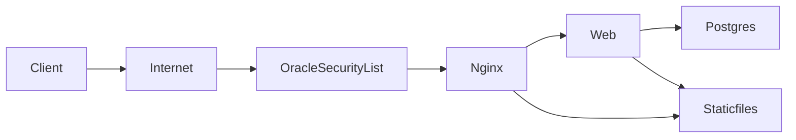

# Oracle Cloud Deployment Guide (Ampere ARM64)

This is the step-by-step deployment runbook focused on Oracle Cloud Free Tier Ampere (ARM64). It aggregates the operational guidance we discussed and references repo files:
- Docker runtime: [Dockerfile](../Dockerfile)
- Entrypoint: [docker/entrypoint.sh](../docker/entrypoint.sh)
- Gunicorn config: [gunicorn.conf.py](../gunicorn.conf.py)
- Nginx config: [docker/nginx/default.conf](../docker/nginx/default.conf)
- Compose (base): [docker-compose.yml](../docker-compose.yml)
- Compose (prod overlay): [docker-compose.prod.yml](../docker-compose.prod.yml)
- Deploy overlay (pull image): [docker-compose.deploy.yml](../docker-compose.deploy.yml)
- Env template: [.env.example](../.env.example)
- Django settings: [ecom/settings.py](../ecom/settings.py)
- CI/CD workflow: [.github/workflows/deploy.yml](../.github/workflows/deploy.yml)



## 1) Prerequisites and Planning

- Instance shape: VM.Standard.A1.Flex (Always Free) with 1 OCPU, 6 GB RAM (adjust later).
- OS: Ubuntu 22.04 LTS or Oracle Linux 8/9.
- Region/AD: If Ampere capacity is unavailable, try a different AD or region.

## 2) Networking and Security Lists

Create or use a VCN with a public subnet:
- Ingress rules (Security List or NSG):
  - TCP 22 (SSH): Source = YOUR IP/CIDR ONLY (do not leave open to 0.0.0.0/0).
  - TCP 80 (HTTP): Source = 0.0.0.0/0.
  - Optional TCP 443 (HTTPS): Source = 0.0.0.0/0 (for later TLS).
- Egress: Allow outbound internet access (default OK).

Security warning:
- Lock SSH to your IP. Never expose port 22 to the world.

## 3) Launch the Compute Instance

- Shape: VM.Standard.A1.Flex, 1 OCPU, 6 GB RAM.
- Image: Ubuntu 22.04 (or Oracle Linux 8/9).
- Networking: Public IPv4 (on public subnet).
- SSH keys: Provide your public key; login user is `ubuntu` (Ubuntu) or `opc` (Oracle Linux).

## 4) Install Docker

SSH in:
```
ssh ubuntu@YOUR_PUBLIC_IP
# or: ssh opc@YOUR_PUBLIC_IP
```

Install Docker:
```
# Ubuntu updates
sudo apt-get update -y && sudo apt-get upgrade -y
# Oracle Linux equivalent:
# sudo dnf upgrade -y

# Install Docker
curl -fsSL https://get.docker.com | sudo sh
sudo usermod -aG docker $USER
newgrp docker
sudo systemctl enable --now docker

# Verify
docker --version
docker run --rm hello-world
```

## 5) OS Firewall (if enabled)

Ubuntu ufw:
```
sudo ufw allow 22/tcp
sudo ufw allow 80/tcp
# Optional (future TLS):
sudo ufw allow 443/tcp
sudo ufw enable
```

Oracle Linux firewalld:
```
sudo firewall-cmd --add-service=http --permanent
sudo firewall-cmd --add-service=https --permanent
sudo firewall-cmd --reload
```

## 6) Place the App on the Server and Configure

Create directory and copy/clone repo:
```
sudo mkdir -p /opt/ecom
sudo chown -R $USER:$USER /opt/ecom
cd /opt/ecom
# git clone <your-repo> .   # or upload files
```

Create production .env from [example](../.env.example):
```
cp .env.example .env
```
Edit `.env`:
- SECRET_KEY: strong random value
- DEBUG=false
- ALLOWED_HOSTS=YOUR_PUBLIC_IP,your.domain
- CSRF_TRUSTED_ORIGINS=http://YOUR_PUBLIC_IP,https://your.domain (must include scheme)
- POSTGRES_USER/POSTGRES_DB/POSTGRES_PASSWORD: set strong values
- DATABASE_URL defaults to internal db service if not overridden

Security warning:
- Never commit `.env`. Keep it only on the server.

## 7) First Production Run (Optional Manual Validation)

Start the stack:
```
docker compose -f docker-compose.yml -f docker-compose.prod.yml up -d --build
```

Services:
- db: Postgres 16-alpine
- web: Gunicorn (runs migrations, collectstatic)
- nginx: serves /static and proxies to web; publishes port 80

Check logs:
```
docker compose logs -f db
docker compose logs -f web
docker compose logs -f nginx
```

Visit:
- http://YOUR_PUBLIC_IP/

## 8) CI/CD (Automated Deployment)

CI/CD files:
- Workflow: [.github/workflows/deploy.yml](../.github/workflows/deploy.yml)
- Deploy overlay: [docker-compose.deploy.yml](../docker-compose.deploy.yml)

How it works:
- On push to main or vX.Y.Z tags:
  - Build ARM64 image with Buildx.
  - Push to GHCR: `ghcr.io/<owner>/<repo>:<git-sha>` and `:latest`.
  - SSH to server and deploy using the deploy overlay to pin `web` image to the new tag.

Server setup for CI/CD:
- Create a `deploy` user; grant Docker access:
  ```
  sudo adduser deploy
  sudo usermod -aG docker deploy
  newgrp docker
  ```
- Put public deploy key into `/home/deploy/.ssh/authorized_keys` (dir 700, file 600).
- Oracle Security List/NSG: restrict SSH (22) to your IP.

GitHub Actions Secrets:
- SSH_HOST → server public IP
- SSH_USER → deploy
- SSH_KEY → private key matching the server’s authorized key
- SSH_PATH → /opt/ecom
- If GHCR private: GHCR_USERNAME and GHCR_TOKEN (PAT with read:packages)

Deployment uses:
```
IMAGE=ghcr.io/<owner>/<repo>:<git-sha> docker compose \
 -f docker-compose.yml -f docker-compose.prod.yml -f docker-compose.deploy.yml pull web

IMAGE=ghcr.io/<owner>/<repo>:<git-sha> docker compose \
 -f docker-compose.yml -f docker-compose.prod.yml -f docker-compose.deploy.yml up -d
```

Rollback:
```
cd /opt/ecom
IMAGE=ghcr.io/<owner>/<repo>:PRIOR_SHA docker compose \
 -f docker-compose.yml -f docker-compose.prod.yml -f docker-compose.deploy.yml up -d
```

## 9) Static Files and Vite

- Vite builds into `static/dist` with manifest; see vite config.
- `collectstatic` copies into `/app/staticfiles`.
- Nginx serves `/static/*` from `/staticfiles/` (mounted read-only).

## 10) Admin and Data Ops

Create superuser:
```
docker compose exec web python manage.py createsuperuser
```

Migrations and static:
```
docker compose exec web python manage.py migrate
docker compose exec web python manage.py collectstatic --noinput
```

Backups:
```
docker compose exec db pg_dump -U "$POSTGRES_USER" "$POSTGRES_DB" > /tmp/ecom.sql
```
Move backups off the VM; store encrypted.

## 11) TLS (HTTPS)

- Recommended: Oracle Load Balancer (Always Free) with TLS termination → forward HTTP to VM.
- Alternative: Extend Nginx + certbot (additional container and config).

## 12) Production Defaults Recap

- Production runs with DEBUG=false (via env and compose overlay).
- SECRET_KEY and DB credentials come from `.env`.
- [ecom/settings.py](../ecom/settings.py) reads from env with SQLite fallback for local dev.

## 13) Troubleshooting

- 502 from Nginx:
  - `docker compose logs -f web nginx`
  - Ensure web is healthy and listening on 0.0.0.0:8000
- 403/CSRF:
  - Verify ALLOWED_HOSTS and CSRF_TRUSTED_ORIGINS (with scheme)
- Static files missing:
  - `docker compose exec web python manage.py collectstatic --noinput`
  - Confirm nginx mounts staticfiles volume and path `/staticfiles/`
- Port 80 unreachable:
  - Check Oracle Security List/NSG and OS firewall
- DB connection:
  - Validate DATABASE_URL and POSTGRES_* match, check db logs

## 14) Resource Tuning (Ampere)

Gunicorn (see [gunicorn.conf.py](../gunicorn.conf.py)):
- WEB_CONCURRENCY=2 for 1 OCPU (adjust by load)
- GUNICORN_THREADS=2
- Increase instance OCPUs/RAM if CPU or memory bottlenecks occur.

## 15) Quick Commands

Start (prod):
```
docker compose -f docker-compose.yml -f docker-compose.prod.yml up -d --build
```

Logs:
```
docker compose logs -f db
docker compose logs -f web
docker compose logs -f nginx
```

Deploy via pinned image:
```
IMAGE=ghcr.io/<owner>/<repo>:<git-sha> docker compose \
 -f docker-compose.yml -f docker-compose.prod.yml -f docker-compose.deploy.yml up -d
```

Stop:
```
docker compose -f docker-compose.yml -f docker-compose.prod.yml down
```

---

Also see:
- CI/CD details: [docs/CI-CD.md](./CI-CD.md)
- Security hardening: [docs/SECURITY.md](./SECURITY.md)
- Root quickstart: [DEPLOY.md](../DEPLOY.md) (original concise runbook)