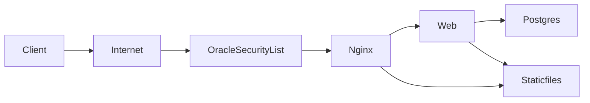

# Production Deployment on Oracle Cloud (Ampere ARM64) + CI/CD

This guide consolidates setup, deployment, CI/CD, and security hardening for running this project on Oracle Cloud Free Tier (Ampere A1). It references repository files such as:
- [`Dockerfile`](../Dockerfile)
- [`docker-compose.yml`](../docker-compose.yml)
- [`docker-compose.prod.yml`](../docker-compose.prod.yml)
- [`docker-compose.deploy.yml`](../docker-compose.deploy.yml)
- [`docker/nginx/default.conf`](../docker/nginx/default.conf)
- [`docker/entrypoint.sh`](../docker/entrypoint.sh)
- [`gunicorn.conf.py`](../gunicorn.conf.py)
- [`.env.example`](../.env.example)
- [`ecom/settings.py`](../ecom/settings.py)
- GitHub Actions workflow: [`.github/workflows/deploy.yml`](../.github/workflows/deploy.yml)

Mermaid high-level diagram


## 1) Architecture Overview

Containers:
- web: Django served by Gunicorn, builds Vite assets, runs migrations and collectstatic. Config in [`Dockerfile`](../Dockerfile) and [`gunicorn.conf.py`](../gunicorn.conf.py).
- db: Postgres 16-alpine (ARM64 compatible), configured in [`docker-compose.yml`](../docker-compose.yml).
- nginx (prod): Serves /static and reverse proxies to web:8000, see [`docker/nginx/default.conf`](../docker/nginx/default.conf).

Volumes:
- postgres-data: Postgres persistent data.
- staticfiles: collectstatic output; written by web, served by nginx.

Networks:
- nginx publishes port 80 externally in production overlay; internal traffic from nginx → web:8000, and web → db:5432.

Static assets pipeline:
- Vite builds into static/dist with manifest based on [`vite.config.mjs`](../vite.config.mjs).
- collectstatic outputs to /app/staticfiles (shared volume).
- Nginx serves /static/* from that volume.

## 2) Oracle Cloud Setup (One-Time)

1) Networking (VCN & Security)
- Use a VCN with a public subnet and assign a public IPv4 to the instance.
- Security List or NSG rules:
  - Ingress:
    - TCP 22 (SSH) from YOUR IP/CIDR only (never 0.0.0.0/0).
    - TCP 80 (HTTP) from 0.0.0.0/0.
    - Optional TCP 443 (HTTPS) from 0.0.0.0/0 if adding TLS later.
  - Egress: Allow outbound to internet (default is fine).

2) Launch the compute instance
- Shape: VM.Standard.A1.Flex (Ampere). Start with 1 OCPU, 6GB RAM.
- OS: Ubuntu 22.04 LTS or Oracle Linux 8/9.
- SSH: Add your public key; login user is ubuntu (Ubuntu) or opc (Oracle Linux).

3) Install Docker on the instance
- SSH to the instance: `ssh ubuntu@YOUR_PUBLIC_IP`
- Update OS:
  - Ubuntu: `sudo apt-get update -y && sudo apt-get upgrade -y`
  - Oracle Linux: `sudo dnf upgrade -y`
- Install Docker:
  - `curl -fsSL https://get.docker.com | sudo sh`
  - `sudo usermod -aG docker $USER`
  - `newgrp docker`
  - `sudo systemctl enable --now docker`
- Verify:
  - `docker --version`
  - `docker run --rm hello-world`

4) OS firewall (if enabled)
- Ubuntu ufw:
  - `sudo ufw allow 22/tcp`
  - `sudo ufw allow 80/tcp`
  - Optional: `sudo ufw allow 443/tcp`
  - `sudo ufw enable`
- Oracle Linux (firewalld):
  - `sudo firewall-cmd --add-service=http --permanent`
  - `sudo firewall-cmd --add-service=https --permanent`
  - `sudo firewall-cmd --reload`

Security reminders:
- Lock SSH (22/tcp) to your IP in Security List/NSG.
- Keep DEBUG off in production; see [`ecom/settings.py`](../ecom/settings.py) and your .env.

## 3) Server Preparation (Project & Environment)

On the server (once):

- Create application directory and set ownership:
  - `sudo mkdir -p /opt/ecom && sudo chown -R $USER:$USER /opt/ecom`
- Copy or clone your repo into `/opt/ecom`.
- Create the production .env:
  - `cp .env.example .env`
  - Edit `.env` with:
    - SECRET_KEY: strong random value
    - DEBUG=false
    - ALLOWED_HOSTS=YOUR_PUBLIC_IP,your.domain
    - CSRF_TRUSTED_ORIGINS=http://YOUR_PUBLIC_IP,https://your.domain
    - POSTGRES_USER/app, POSTGRES_DB/ecom, POSTGRES_PASSWORD: set strong password
- Optional first run to validate manually:
  - `docker compose -f docker-compose.yml -f docker-compose.prod.yml up -d --build`
  - Open `http://YOUR_PUBLIC_IP/` in browser.

## 4) Production Runbook

Primary files:
- Compose base: [`docker-compose.yml`](../docker-compose.yml)
- Production overlay: [`docker-compose.prod.yml`](../docker-compose.prod.yml)

Commands:
- Build & start (prod):
  - `docker compose -f docker-compose.yml -f docker-compose.prod.yml up -d --build`
- Logs:
  - `docker compose logs -f db`
  - `docker compose logs -f web`
  - `docker compose logs -f nginx`
- Exec:
  - `docker compose exec web python manage.py createsuperuser`
  - `docker compose exec web python manage.py migrate`
  - `docker compose exec web python manage.py collectstatic --noinput`
- Stop:
  - `docker compose -f docker-compose.yml -f docker-compose.prod.yml down` (data persists in volumes)

Static files:
- Built via Vite to `static/dist` and collected to `/app/staticfiles`.
- Served by Nginx from `/staticfiles/` (read-only volume mount).

## 5) CI/CD Pipeline (GitHub Actions → GHCR → SSH → Docker Compose)

Pipeline files:
- GitHub Actions workflow: [`.github/workflows/deploy.yml`](../.github/workflows/deploy.yml)
- Deploy overlay: [`docker-compose.deploy.yml`](../docker-compose.deploy.yml)

How it works:
- On push to `main` or `vX.Y.Z` tags:
  - Build ARM64 image with Buildx.
  - Push to GHCR: `ghcr.io/<owner>/<repo>:<git-sha>` and `:latest`.
  - SSH into the Oracle VM and deploy using:
    - `IMAGE=ghcr.io/<owner>/<repo>:<git-sha> docker compose -f docker-compose.yml -f docker-compose.prod.yml -f docker-compose.deploy.yml pull web`
    - `IMAGE=... docker compose -f ... up -d`

Server one-time setup for CI/CD:
- Create a non-root deploy user with Docker access:
  - `sudo adduser deploy`
  - `sudo usermod -aG docker deploy`
  - `newgrp docker`
- Place repo in `/opt/ecom`, ensure `.env` exists with production values.
- Install SSH key for the CI deploy user (`/home/deploy/.ssh/authorized_keys`).
- Lock SSH ingress to your IP in Security List/NSG.

GitHub repository secrets (Settings → Secrets and variables → Actions):
- SSH_HOST: `your.public.ip`
- SSH_USER: `deploy`
- SSH_PORT: `22` (optional)
- SSH_KEY: Private key matching deploy user’s public key
- SSH_PATH: `/opt/ecom`
- If GHCR package is private:
  - GHCR_USERNAME: your GitHub username
  - GHCR_TOKEN: PAT with read:packages

Production environment protection (recommended):
- Settings → Environments → “production”
  - Require reviewers / manual approval
  - Limit deployment branches

Rollback:
- Re-deploy a previous tag:
  - SSH to server: `cd $SSH_PATH`
  - `IMAGE=ghcr.io/<owner>/<repo>:PRIOR_SHA docker compose -f docker-compose.yml -f docker-compose.prod.yml -f docker-compose.deploy.yml up -d`

## 6) Security Checklist

- Networking:
  - SSH (22/tcp): restrict to your IP/CIDR in Security List/NSG.
  - HTTP/HTTPS only as needed (80/443).
- Environment:
  - Do not commit `.env`. Keep it on the server.
  - Use strong `SECRET_KEY` and `POSTGRES_PASSWORD`.
  - `DEBUG=false` in production.
  - Set `ALLOWED_HOSTS` and `CSRF_TRUSTED_ORIGINS` properly (include scheme for CSRF origins).
- Database:
  - Only accessible within Docker network (no external port mapping).
  - Schedule regular `pg_dump` backups off the VM.
- Updates:
  - Gate deployments with environment approvals in GitHub Actions.
  - Consider two-step deploy for risky migrations (migrate first, then update image).
- TLS:
  - Prefer an Oracle Load Balancer (Always Free) to terminate TLS, or extend Nginx with certbot when ready.

## 7) Troubleshooting

Common issues:
- 502 from Nginx:
  - Check `docker compose logs -f web nginx`
  - Ensure `web` is healthy and bound on 0.0.0.0:8000
- 403/CSRF:
  - Verify `ALLOWED_HOSTS` and `CSRF_TRUSTED_ORIGINS` in `.env`
- Static files not loading:
  - `docker compose exec web python manage.py collectstatic --noinput`
  - Ensure `nginx` mounts `staticfiles` volume and config path is correct (`/staticfiles/`)
- Database connection:
  - Confirm `DATABASE_URL` and `POSTGRES_*` match; check Postgres logs
- Port not reachable:
  - Open port 80 in Security List/NSG and OS firewall
- Disk space:
  - Monitor `postgres-data` and `/var/lib/docker` usage; attach/mount a Block Volume if needed.

## 8) Resource Tuning (Ampere)

- Gunicorn settings via .env (see defaults in [`gunicorn.conf.py`](../gunicorn.conf.py)):
  - `WEB_CONCURRENCY=2` for 1 OCPU
  - `GUNICORN_THREADS=2`
  - Adjust based on CPU/memory and request patterns.
- Scale instance shape (OCPUs/RAM) if CPU saturates or memory pressure occurs.

## 9) Local Development Tips

- Default `DEBUG=True` locally unless overridden by env (see [`ecom/settings.py`](../ecom/settings.py)).
- HMR:
  - Terminal 1: `npm run dev`
  - Terminal 2: `uv run python manage.py runserver`
- Manifest mode (without HMR):
  - `npm run build` then run `manage.py runserver` with `DEBUG=false`

## 10) Reference Commands (Quick Copy)

Initial production run:
```
docker compose -f docker-compose.yml -f docker-compose.prod.yml up -d --build
```

CI/CD deploy on server (performed by workflow):
```
IMAGE=ghcr.io/<owner>/<repo>:<git-sha> docker compose -f docker-compose.yml -f docker-compose.prod.yml -f docker-compose.deploy.yml pull web
IMAGE=ghcr.io/<owner>/<repo>:<git-sha> docker compose -f docker-compose.yml -f docker-compose.prod.yml -f docker-compose.deploy.yml up -d
```

Backup:
```
docker compose exec db pg_dump -U "$POSTGRES_USER" "$POSTGRES_DB" > /tmp/ecom.sql
```

Migrations / admin:
```
docker compose exec web python manage.py migrate
docker compose exec web python manage.py createsuperuser
```

Stop:
```
docker compose -f docker-compose.yml -f docker-compose.prod.yml down
```

---

For a concise runbook, see also the root-level [`DEPLOY.md`](../DEPLOY.md).
## 11) Application Architecture and SSR + HTMX Development Guide

This section documents how the app is structured for Server‑Side Rendering (SSR) with htmx partials, Alpine.js for client‑side UI state, Tailwind CSS utilities, and Vite asset pipeline. It also explains how to add new features following the same pattern.

Key references
- Views and SSR helper:
  - [core/utils.py](../core/utils.py)
  - [core/views.py](../core/views.py)
- Templates (full pages and partials):
  - Full pages: [templates/core/products.html](../templates/core/products.html), [templates/core/cart.html](../templates/core/cart.html), [templates/core/product_detail.html](../templates/core/product_detail.html)
  - Partials (underscore‑prefixed): [templates/core/_product_grid.html](../templates/core/_product_grid.html), [templates/core/_cart_table.html](../templates/core/_cart_table.html), [templates/core/_cart_summary.html](../templates/core/_cart_summary.html), [templates/core/_cart_content.html](../templates/core/_cart_content.html), [templates/core/_search_suggestions.html](../templates/core/_search_suggestions.html), [templates/includes/_cart_badge.html](../templates/includes/_cart_badge.html), [templates/components/_wishlist_button.html](../templates/components/_wishlist_button.html)
- SEO + base layout:
  - [templates/base.html](../templates/base.html)
  - Sitemaps/robots: [core/sitemaps.py](../core/sitemaps.py), sitemap.xml/robots.txt in [core/urls.py](../core/urls.py)
- Frontend pipeline:
  - [vite.config.mjs](../vite.config.mjs), [tailwind.config.js](../tailwind.config.js), [postcss.config.js](../postcss.config.js)
  - Entry assets: [frontend/main.js](../frontend/main.js), [frontend/style.css](../frontend/style.css)

### A. SSR pattern and “two‑in‑one” views with htmx

We render the full base layout for normal requests and only the specific partial for HTMX requests (HX-Request header).

- Helper: [python.def hx_render()](../core/utils.py:1)

Usage example in a list view (grid + filters + pagination):

- [python.def products_list()](../core/views.py:19)
  - Full request → [templates/core/products.html](../templates/core/products.html)
  - HX request → [templates/core/_product_grid.html](../templates/core/_product_grid.html)

Cart page follows the same idea:

- [python.def cart_view()](../core/views.py:94)
  - Full → [templates/core/cart.html](../templates/core/cart.html)
  - Partial → [templates/core/_cart_content.html](../templates/core/_cart_content.html)
  - Cart item update/remove returns [templates/core/_cart_content.html](../templates/core/_cart_content.html) when “context=page” is posted from the cart page.

Conventions:
- Partial templates are underscore‑prefixed and never extend base.html.
- Full templates extend base.html and include partials with .

### B. htmx usage patterns implemented

1) Product filtering (GET)
- Filter form on [templates/core/products.html](../templates/core/products.html) uses:
  - hx-get to products list URL
  - hx-target="#product-grid"
  - hx-push-url="true" to update the browser URL
  - hx-indicator to show a “Loading...” indicator inside the grid

2) Pagination (GET)
- Page links in [templates/core/_product_grid.html](../templates/core/_product_grid.html) use hx-get to the same list endpoint + hx-target + hx-push-url.

3) Search autocomplete (GET)
- Search input in [templates/core/products.html](../templates/core/products.html) does:
  - hx-get to “/search/suggest”
  - hx-trigger="keyup changed delay:300ms"
  - hx-target to a div under the input
- Server returns [templates/core/_search_suggestions.html](../templates/core/_search_suggestions.html).

4) Add to cart (POST)
- Buttons on cards and detail page post to cart_add:
  - hx-target="#cart-badge"
  - hx-swap="outerHTML"
- View returns [templates/includes/_cart_badge.html](../templates/includes/_cart_badge.html) and sets HX-Trigger: cart-changed.

5) Cart updates on cart page (POST)
- Quantity update/remove forms include hidden input context=page:
  - hx-target="#cart-content"
  - The server returns [templates/core/_cart_content.html](../templates/core/_cart_content.html) to refresh both table + summary, and also triggers cart-changed to update navbar badge.

6) Wishlist toggle (POST)
- Button swaps itself via:
  - hx-post to /wishlist/toggle
  - hx-target="this", hx-swap="outerHTML"
- Partial is [templates/components/_wishlist_button.html](../templates/components/_wishlist_button.html); view is [python.def wishlist_toggle()](../core/views.py:72).

7) Navbar cart badge auto‑refresh
- [templates/includes/navbar.html](../templates/includes/navbar.html) contains:
  - #cart-badge that hx-get’s /cart/badge on load and whenever the “cart-changed” event is triggered on body.

### C. Alpine.js usage

- Navbar mobile menu toggler in [templates/includes/navbar.html](../templates/includes/navbar.html) with x-data="{ open: false }".
- Product detail minimal gallery state in [templates/core/product_detail.html](../templates/core/product_detail.html) with x-data for currentImage (extendable).

### D. SEO foundations

- [templates/base.html](../templates/base.html) provides:
  - <link rel="canonical"> via request.build_absolute_uri
  - Blocks:
    -  (required per page)
    -  for description
    -  and  (default “E‑Shop”)
    -  to inject page‑specific meta/JSON‑LD
- Product JSON‑LD:
  - Injected on detail page in [templates/core/product_detail.html](../templates/core/product_detail.html).
- Sitemap + robots:
  - [core/sitemaps.py](../core/sitemaps.py) for ProductSitemap and StaticViewSitemap
  - routes in [core/urls.py](../core/urls.py) for /sitemap.xml and /robots.txt
  - [python.def robots_txt()](../core/views.py:211) points to sitemap.

### E. Tailwind + Vite

- Tailwind scans:
  - templates/**/*.html
  - frontend/**/*.{js,ts}
- Dev:
  - Terminal A: npm run dev
  - Terminal B: python manage.py runserver
- Manifest mode (no HMR): npm run build and runserver with DEBUG=false

### F. Adding a new HTMX partial feature (Recipe)

1) Create an underscore partial for the fragment you want to update dynamically (e.g., templates/core/_my_component.html).
2) Add a full page or an include that hosts the container (id) where the partial will be swapped.
3) Write/extend the view:
   - For GET partial updates, check HX-Request to return the partial only.
   - For POST mutations, decide:
     - Navbar micro updates (badge) → return only the small partial and set HX-Trigger to notify others.
     - Page‑level re‑render (like cart) → return a larger partial with everything cohesive.
4) Wire HTMX attributes:
   - hx-get or hx-post to your endpoint
   - hx-target to the container or “this”
   - hx-swap strategy (“innerHTML”, “outerHTML”, etc.)
   - hx-push-url where appropriate for navigation semantics
   - Optional: hx-indicator for loading feedback
5) Keep templates small and reusable; for server logic re-use query builders and annotate context carefully.

### G. Testing

Manual test plan
- See [docs/TESTING.md](./TESTING.md) for an exhaustive step‑by‑step manual checklist.

Automated tests
- Basic integration tests live in [core/tests.py](../core/tests.py)
- Run:
  - python manage.py test

### H. Known good endpoints (quick)

- GET / → 302 → /products/
- GET /products/ → full page
- GET /products/?q=... → HTMX partial (grid only)
- GET /search/suggest/?q=... → HTMX partial (list)
- POST /wishlist/toggle/ → HTMX partial (button)
- POST /cart/add → HTMX partial (badge)
- POST /cart/update (context=page) → HTMX partial (full cart content)
- POST /cart/remove (context=page) → HTMX partial (full cart content)
- GET /robots.txt → text/plain
- GET /sitemap.xml → XML
